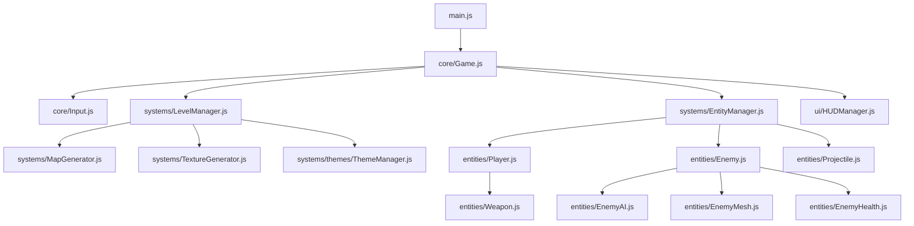

# 🗺️ ARCHITECTURE TECHNIQUE & GUIDE DE DÉVELOPPEMENT APPROFONDI (IA-RogueLike)

Ce document constitue un audit de niveau "Deep Dive" et une fiche de route pour les futurs **LLMs** et **développeurs** travaillant sur la base de code d'**IA-RogueLike**. Il fournit les équations de calcul exactes, les structures de données, la logique algorithmique et les optimisations du système.

---

## 🏛️ 1. ARCHITECTURE DES COMPOSANTS & PARADIGME DU MOTEUR

Le jeu utilise un rendu WebGL via **Three.js** dans un conteneur unique avec une boucle de rendu synchronisée.



### Boucle de Rendu Principale
La boucle est initialisée dans `Game.js` via `renderer.setAnimationLoop(() => this.update())`.
* **Delta Time** : Calculé par `const dt = this.clock.getDelta();`.
* **Pause** : Si `this.isPaused` est vrai (menu actif), le moteur appelle `renderer.render(this.scene, this.camera)` mais court-circuite toutes les mises à jour logiques.

---

## 📊 2. STRUCTURES DE DONNÉES & SCHÉMAS MATHÉMATIQUES

### A. Équilibrage des Statistiques d'Arme (`Weapon.js`)
L'arme magique (`Weapon`) possède les statistiques internes suivantes (calculées dans `recalculateStats()`) :

| Variable | Stat Upgrade | Formule Mathématique / Équation de Calcul |
| :--- | :--- | :--- |
| `damage` | `damage` | `this.baseDamage * (1 + level * 0.18) * pactDamageMultiplier / bulletCount` |
| `fireRate` | `fireRate` | `Math.max(0.05, this.baseFireRate * Math.pow(0.94, level)) / pactFireRateMultiplier` (divisé par 2 sous Berserk) |
| `maxAmmo` | `ammo` | `Math.floor(this.baseMaxAmmo * (1 + level * 0.25))` |
| `reloadTime`| `reload` | `Math.max(0.1, this.baseReloadTime * Math.pow(0.88, level))` |
| `range` | `range` | `this.baseRange * (1 + level * 0.20)` |
| `projectileSpeed` | `projectileSpeed` | `this.baseProjectileSpeed * (1 + level * 0.06) * pactProjectileSpeedMultiplier` |
| `bulletCount` | `bulletCount` | `1 + level` (nombre de projectiles tirés simultanément en éventail) |
| `arc` | — | `this.bulletCount * 2` (angle d'écartement en degrés du tir multiple) |
| `piercing` | `piercing` | `level` (nombre de traversées d'ennemis autorisées par projectile) |
| `critChance` | `critChance` | `this.baseCritChance + level * 0.10` (pourcentage de 0 à 100%) |
| `critDamage` | `critDamage` | `this.baseCritDamage + level * 0.20` (multiplicateur de dégâts bruts) |
| `knockback` | `knockback` | `level` (force de poussée appliquée à la cible) |
| `explosion` | `explosion` | `level * 0.10` (pourcentage de chance de déclencher une explosion AOE à l'impact) |
| `ricochet` | `ricochet` | `level` (nombre maximal de rebonds autorisés sur l'environnement) |

#### Mécanique secrète : Impact Cinétique
Si la vitesse du projectile dépasse la vitesse de base (`projectileSpeed > baseProjectileSpeed`), les dégâts sont augmentés par conversion cinétique :
$$\text{damage}_{\text{final}} = \text{damage} \times \left(1 + \left(\frac{\text{projectileSpeed}}{\text{baseProjectileSpeed}} - 1\right) \times 0.5\right)$$

### B. Statistiques & Modificateurs du Joueur (`Player.js`)
* **Santé Maximale** : `this.maxHealth = (100 + this.stats.maxHealth * 20) * this.pactHpMultiplier` (diminuée par `this.pactHpReduction`).
* **Armure** : `this.armor = this.stats.armor * 0.05 + this.pactArmorBonus`. Réduction directe appliquée aux dégâts entrants. Plafonnée à 80% (`Math.min(0.8, this.armor)`).
* **Régénération active** : `this.regen = this.stats.regen * 0.5` PV par seconde (s'additionne aux pactes régénératifs).
* **Vol de vie** : `this.vampirism = this.stats.vampirism * 0.02 + this.pactVampirism`. Restaure des PV proportionnellement aux dégâts infligés : $\text{PV}_{\text{restaurés}} = \text{damage}_{\text{infligé}} \times \text{vampirism}$.
* **Vitesse de déplacement** : `this.speed = (CONSTANTS.PLAYER_SPEED + this.stats.speed * 0.8) * this.pactSpeedMultiplier * this.slowMultiplier`.
* **Immolation** : Génère un anneau visuel `THREE.RingGeometry(4.4, 4.5, 64)`. Inflige `this.stats.immolation * 2.5` dégâts toutes les 0,5 secondes à tous les monstres à moins de 4,5 mètres.

---

## ⚡ 3. GESTION DES COLLISIONS & PHYSIQUE DES PROJECTILES (`Projectile.js`)

Le projectile se déplace de façon linéaire (par défaut) ou parabolique (si gravité $>0$) :

### Algorithmes de Collisions 3D
1. **Sol** : Si $y \le 0.05$ (hauteur du sol) :
   * Si `ricochet > 0` : `direction.y *= -1`, `ricochet--`, `damage *= 1.25`, et recalcule la position avec $y = 0.06$ pour éviter le blocage.
   * Sinon : Destruction du projectile.
2. **Murs du Donjon** : Détecté par `levelManager.isWall(x, z)` :
   * Si vrai et $y < 2.5$ (sous la hauteur des murs) :
     * Si `ricochet > 0` : Le système recule le projectile de sa distance de frame, teste la collision latérale sur X et Z séparément pour inverser la bonne composante (`direction.x *= -1` ou `direction.z *= -1`), applique le multiplicateur de dégâts de rebond ($\times 1.25$), et réduit le compteur de ricochets.
3. **Îles Célestes Flottantes** : Teste l'intersection avec l'AABB (Bounding Box alignée sur les axes) de chaque structure céleste :
   * Si la boîte englobante contient la coordonnée du projectile :
     * Détermine l'axe de réflexion en comparant les distances relatives au centre de l'AABB sur les axes X, Y et Z.
     * Inverse l'axe d'incidence dominant.

---

## 🤖 4. COMPORTEMENT DE L'IA & PATHFINDING (`Pathfinder.js` & `EnemyAI.js`)

### Algorithme A* et optimisation de mémoire
L'algorithme A* d'**IA-RogueLike** est optimisé pour s'exécuter sans allocations de mémoire cycliques (Garbage Collector friendly) en réutilisant ses collections internes (`_openSet`, `_closedSet`, `_cameFrom`, `_gScore`) à chaque appel de calcul.

```javascript
// Pathfinder.js : Utilisation d'un Min-Heap binaire pour trier l'Open Set en O(log N)
class MinHeap {
    // bubbleUp et sinkDown garantissent que le nœud de f(n) minimal est toujours à l'index 0
}
```

* **Heuristique** : Distance Octile pour autoriser les mouvements sur 8 directions :
  $$H(a, b) = (dx + dz) + (\sqrt{2} - 2) \times \min(dx, dz)$$
* **Lissage de Chemin (Path Smoothing)** : 
  Pour éviter les déplacements brusques en grille, le pathfinder trace un segment de visibilité directe (Line of Sight) depuis le monstre vers chaque étape du chemin. Si aucune paroi n'obstrue la vue (test d'échantillonnage de rayons), les nœuds intermédiaires sont sautés (`_smoothPath`), permettant aux sentinelles de couper les virages naturellement.
* **Séparation (Flocking)** : Les monstres appliquent une force répulsive réciproque :
  $$\vec{F}_{\text{separation}} = \sum_{i=1}^{n} \frac{\vec{P}_{\text{moi}} - \vec{P}_{i}}{\text{distance}(\vec{P}_{\text{moi}}, \vec{P}_{i})}$$
  Cette force est injectée dans le vecteur de mouvement final pour empêcher les ennemis de se superposer en un point unique.

---

## 🎨 5. GÉNÉRATION DE TEXTURES PROCÉDURALES (`TextureGenerator.js`)

Les textures du jeu sont générées dynamiquement en dessinant sur des canevas HTML5 2D convertis en `THREE.CanvasTexture` :

* **Glow & Runes (`createRuneWallTexture`)** : Calcule des magic circles concentriques à l'aide de formules polaires, y inscrit un polygone régulier à $N$ côtés (`innerPolygonSides`), dessine des étoiles intérieures et trace des mini runes géométriques (triangles, cercles pointés) à la périphérie avec un effet de flou lumineux simulé par `shadowBlur`.
* **Baked Floor (`createBakedFloorTexture`)** : Génère une texture de fond de $2048 \times 2048$ pixels. Pour chaque salle de type `event`, l'algorithme calcule le centre exact en pixels et y dessine un pentacle violet lumineux géant doté d'un halo emissif (utilisant les ombres portées de la toile Canvas).

---

## ⚠️ 6. ALERTE ANOMALIE : BIOMES ORPHELINS (À CORRIGER)

> [!IMPORTANT]
> Le dossier `src/systems/themes/` contient des configurations de biomes extrêmement détaillées (avec modèles 3D procéduraux de sandbags, racks de serveurs clignotants, caisses, outils) qui ne sont pas référencées dans le jeu.

### Fichiers Orphelins :
* [BunkerTheme.js](file:///home/drkata/Documents/IA-RogueLike/src/systems/themes/BunkerTheme.js)
* [IndustrialTheme.js](file:///home/drkata/Documents/IA-RogueLike/src/systems/themes/IndustrialTheme.js)
* [LabTheme.js](file:///home/drkata/Documents/IA-RogueLike/src/systems/themes/LabTheme.js)

### Solution à appliquer pour le prochain LLM :
Pour intégrer ces thèmes, éditez le fichier [ThemeManager.js](file:///home/drkata/Documents/IA-RogueLike/src/systems/themes/ThemeManager.js) comme suit :

```javascript
// 1. Ajoutez les imports en haut du fichier ThemeManager.js
import { BunkerTheme } from './BunkerTheme.js';
import { IndustrialTheme } from './IndustrialTheme.js';
import { LabTheme } from './LabTheme.js';

// 2. Modifiez le constructeur pour enregistrer tous les thèmes
export class ThemeManager {
    constructor() {
        this.themes = [
            EnchantedForestTheme,
            MedievalCityTheme,
            DeepCaveTheme,
            DemonicBaseTheme,
            BunkerTheme,
            IndustrialTheme,
            LabTheme
        ];
    }
    // ... reste du code inchangé
}
```

---

## 🎮 7. LOGIQUE D'ATTAQUE DU BOSS SENTINEL (`BossSentinel.js`)

Le Boss Sentinel possède 4 mécaniques d'attaque distinctes fonctionnant sur des timers et des cooldowns indépendants :
1. **Laser Sweep (Balayage) - Cooldown 1.5s** : Déclenche une nova complète projetant 120 sphères de plasma de $0.2$m à $35$ m/s sur un angle radial de $360^\circ$ centré sur l'altitude du joueur.
2. **Homing Missiles (Missiles Guidés) - Cooldown 6.0s** : Tire des projectiles qui traquent continuellement le joueur en réalignant leur vecteur directionnel par interpolation linéaire (`lerp`) à chaque frame.
3. **Spiral Attack (Attaque en Hélice) - Cooldown 15.0s** : Force le boss dans un état de blocage rotatif pendant 4 secondes où il tire des projectiles continus en spirale double.
4. **Summon (Vassaux) - Cooldown 20.0s** : Fait apparaître des `MagicalSentinel` volantes pour détourner le feu du joueur.
