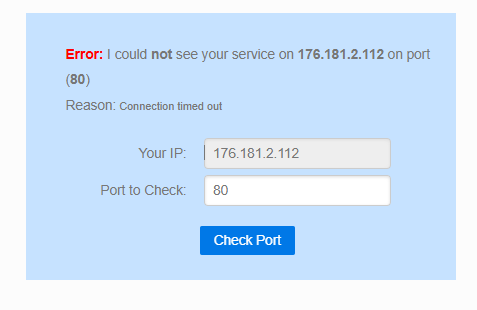
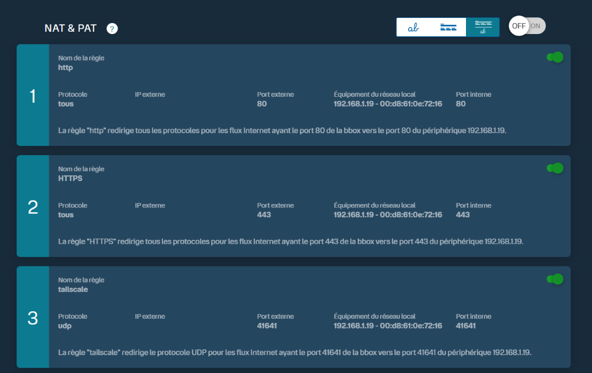

# 🪄 IA-RogueLike : Le Donjon des Ricochets Célestes

[](https://vite.dev/)
[](https://threejs.org/)
[]()

**IA-RogueLike** est un jeu de tir à la première personne (FPS) en 3D développé avec les dernières technologies du web (Three.js, Vite). Plongez dans un donjon médiéval-fantastique sombre et mystique où la maîtrise des trajectoires physiques et des rebonds est la clé de votre survie.

Armé de votre bâton magique, progressez de salle en salle, éliminez les sentinelles magiques, esquivez les pièges mortels et personnalisez vos capacités pour descendre le plus profondément possible dans les tréfonds du donjon.



---

## 🎮 Fonctionnalités Majeures



* **🎯 Système de Ricochet 3D & Ciel Ouvert** : Vos projectiles magiques rebondissent de manière réaliste sur le sol et sur un vaste archipel d'**îles célestes flottantes**. Ces îles, suspendues entre 8 et 40 mètres d'altitude, vous permettent d'atteindre des ennemis cachés derrière des abris par des tirs en cloche indirects.
* **🗺️ Génération Procedurale Alignée** : Chaque niveau est généré dynamiquement et décoré selon 4 biomes uniques (Forêt Enchantée, Cité Médiévale, Cavernes Profondes et Base Abyssale). Les îles flottantes dans le ciel s'adaptent visuellement au biome en temps réel (herbe, pavés, roche volcanique).
* **💰 Économie d'Or & Marchand Mystique** : Récupérez l'or laissé par les monstres défaits ou cachés dans les coffres au trésor. Rencontrez le Marchand Magique et échangez votre butin contre des potions de vie, des munitions, des sceaux de bouclier ou des améliorations de statistiques directes.
* **🩸 Autels de Pactes Anciens** : Tentez votre chance auprès des autels mystiques. Acceptez des pactes scellés de manière permanente : sacrifiez une portion de vos PV max ou de votre vitesse de course en échange de bonus massifs de dégâts ou d'armure.
* **⚠️ Pièges Environnementaux & Obstacles** : Restez sur vos gardes ! Le sol recèle des pièges à pointes rétractables géantes infligeant des dégâts massifs.
* **👑 Combats de Sentinelles Majeures** : Tous les 10 étages, les gardiens se rassemblent dans des arènes de boss redoutables pour tester votre habileté de tir et de déplacement.

---

## ⌨️ Commandes de Jeu

* **Se déplacer** : `Z` `Q` `S` `D` (ou `W` `A` `S` `D`)
* **Sauter** : `Espace`
* **Viser & Tirer** : `Souris` / `Clic gauche`
* **Recharger** : `R`
* **Interagir (Marchand, Autel, Fontaine, Coffre)** : `E`
* **Menu de Pause & Amélioration** : Automatique lors des montées de niveau ou transitions d'étages.

---

## 🚀 Installation et Lancement Rapide

Le projet comprend un script automatisé pour installer et lancer le jeu en une seule commande, idéal pour les débutants.

### Méthode 1 : Lancement Automatique (Recommandé)

Ouvrez votre terminal dans le dossier du projet et lancez :

```bash
./setup.sh
```

Le script vérifiera vos prérequis (Node.js), installera les dépendances nécessaires et démarrera automatiquement le serveur de développement.

### Méthode 2 : Lancement Manuel

Si vous préférez installer le projet manuellement, exécutez les commandes suivantes :

1. **Installer les dépendances** :
   ```bash
   npm install
   ```
2. **Lancer le serveur de développement** :
   ```bash
   npm run dev
   ```
3. **Jouer** :
   Ouvrez votre navigateur et accédez à l'adresse locale : [http://localhost:5173](http://localhost:5173)

---

## 🏗️ Structure du Projet

```text
IA-RogueLike/
├── setup.sh                 # Script d'installation et de lancement
├── index.html               # Point d'entrée HTML et overlays (Boutique, Autel, HUD)
├── src/
│   ├── main.js              # Initialisation de l'application
│   ├── core/
│   │   ├── Game.js          # Moteur principal et boucle de jeu
│   │   └── Constants.js     # Variables d'équilibrage et de configuration
│   ├── entities/
│   │   ├── Player.js        # Gestion du joueur, statistiques et or
│   │   ├── Projectile.js    # Physique des tirs, gravité et calcul des ricochets
│   │   ├── Weapon.js        # Arsenal magique et upgrades
│   │   ├── Enemy.js         # IA des monstres standards
│   │   ├── MagicalShop.js   # Marchand Mystique interactive
│   │   ├── MagicAltar.js    # Autels de pactes permanents
│   │   └── SpikeTrap.js     # Pièges de pointes rétractables
│   ├── systems/
│   │   ├── LevelManager.js  # Assemblage 3D, skybox et îles flottantes
│   │   ├── MapGenerator.js  # Algorithme de génération de donjon
│   │   └── SoundManager.js  # Sons et effets sonores rétro
│   └── ui/
│       ├── HUDManager.js    # Gestion de l'affichage tête haute
│       └── hud.css          # Styles visuels médiévaux-fantastiques du HUD
```

---

*Développé avec passion pour allier la nostalgie des Rogue-likes rétro et la modernité des rendus 3D web.* 🔮
